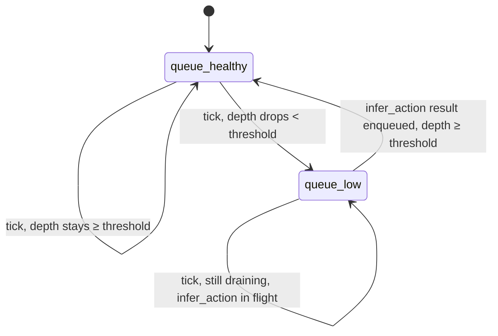

# control-loop context

This context owns the bb bot's tick loop end to end on the Elixir/BEAM side:
the queue, the timing policy, and the client code for both
[model-runtime](../model-runtime/design.md) adapters. `model-runtime` is a
sibling and this context's only supplier; references to it are explicit
pointers.

## 00 Foundation

:::goal
**Elixir owns the queue and the timing, not Python**

The `ActionQueue`'s low-water threshold and request timing are decided here,
in a supervised Elixir process — never inherited as a policy from the Python
side. See
[ADR-0002](../../adr/0002-elixir-owns-the-control-loop.md#adr-0002).
:::

:::goal
**Two adapters behind one port, swappable without upstream change**

`ControlLoop` calls `infer_action` through whichever adapter is active
(emily-native or the ZeroMQ client) without any other code in this context
knowing which one is in use. The emily-native adapter may be reached
in-process or across a BEAM cluster (a remote
[InferenceServer](../model-runtime/design.md)) — a topology axis orthogonal to
the port, not a third adapter
([ADR-0010](../../adr/0010-beam-distribution-orthogonal-to-infer-action-port.md#adr-0010));
the call site is a plain `GenServer.call` either way.
:::

:::no-goal
**Not robot control logic**

Kinematics, safety clamping, and action interpolation between ticks are not
designed here — this context is the `infer_action` caller and queue owner,
nothing more.
:::

:::invariant {enforcement=convention}
**The queue is never read past its safe depth**

`ControlLoop` never pops an action from an empty `ActionQueue` — a tick that
would empty the queue below its low-water threshold has already triggered the
next `infer_action` call before that tick executes.
:::

:::invariant {enforcement=convention}
**An action is never executed twice**

Popping an action from the `ActionQueue` is the same step as marking it
executed; no code path can re-pop or re-send a consumed action.
:::

:::principle {id=P1 lens=state}
**The queue is a value across time, owned by one process**

`ActionQueue`'s identity persists across ticks, but every mutation goes
through `ControlLoop` — no other process reaches in and no history is lost:
"what was queued before this tick?" is always answerable from the GenServer's
own state.
:::

## 01 Components

:::cards {cols=2}

### ControlLoop `lens:state`

**Own the tick.** A GenServer holding the current `ActionQueue`, popping one
action per tick, and triggering `infer_action` calls when the queue runs low.
The aggregate root of this context — every invariant on the queue is enforced
here. See 01.1.

### ActionQueue `lens:invariants`

**Own the ordered, currently-executing-plus-queued actions.** An entity whose
identity persists across ticks (this is the state lens's "value across
time" case) — enqueue and pop are its only two operations, both owned by
`ControlLoop`. See 01.2.

### ZeroMQ client `lens:robustness`

**Own the network call to the Python fallback adapter.** Reconnect and
timeout handling for the case where `model-runtime`'s Python process is
reached over a LAN link that can drop. See 01.3.
:::

### 01.1 ControlLoop — responsibility, interface, invariants, state machine

**Responsible for:** ticking at the bb bot's target rate, popping the next
queued action and sending it to the bot's actuators, and calling
`infer_action` through the active adapter when the queue's depth drops below
its low-water threshold.

**Interface:**
```elixir
ControlLoop.start_link(
  adapter: :emily_native | :zeromq_fallback,
  observation_source: (-> observation),   # injected; default a fixed placeholder
  actuator_sink: (action -> any())         # injected; default a log line
) :: {:ok, pid()}
ControlLoop.tick(pid()) :: :ok  # invoked on the tick timer
```

**Interacts with:** two injected external seams, symmetric — its
[observation source](CONTEXT.md#term-observation-source) (a `(-> observation)`
function called to get the current observation when firing `infer_action`) and
its actuator interface (the `(action -> any())` sink each popped action is sent
to). Both are out-of-scope providers here — a no-goal; the
[demo](../demo/design.md)'s
[sim env adapter](../demo/CONTEXT.md#term-sim-env-adapter) is one concrete
instance supplying both. Also the active
[infer_action port](../model-runtime/CONTEXT.md#term-infer-action-port) adapter,
called exactly the same way regardless of which one is configured — whether the
emily-native adapter is in-process or a remote
[InferenceServer](../model-runtime/design.md) across the cluster
([ADR-0010](../../adr/0010-beam-distribution-orthogonal-to-infer-action-port.md#adr-0010)).

**Invariants held:** the queue-never-read-past-safe-depth and
action-never-executed-twice invariants from this document's foundation — both
enforced here, since `ControlLoop` is the sole caller of `ActionQueue`'s
operations.

**State machine:** `ControlLoop` has two states per tick outcome —
`queue-healthy` (depth ≥ low-water threshold: pop and send, no
`infer_action` call) and `queue-low` (depth < threshold: pop and send, *and*
fire an async `infer_action` call whose result re-enters as an `enqueue`
event on completion). The only transition edge is threshold-crossing,
checked every tick; there is no re-entrant state — an in-flight
`infer_action` call does not block subsequent ticks, which keep draining the
queue from what is already there.



**Fails:** an `infer_action` call that times out or errors leaves the queue
draining on what it already has — the tick loop never blocks waiting for a
result; a queue that empties out entirely before a result returns is a real
degraded condition this context surfaces (as an event/log), but the response
to it (hold last action? stop the bot?) is robot-control logic and out of
scope here (no-goal).

### 01.2 ActionQueue — responsibility, interface, invariants

**Responsible for:** holding the ordered sequence of not-yet-executed
actions; merging a newly returned [action chunk](../model-runtime/CONTEXT.md#term-action-chunk)
with whatever is still queued when a new one arrives.

**Interface:**
```elixir
ActionQueue.enqueue(queue, action_chunk) :: ActionQueue.t()
ActionQueue.pop(queue) :: {action, ActionQueue.t()}
ActionQueue.depth(queue) :: non_neg_integer()
```

**Interacts with:** only `ControlLoop`, which owns every call site — no other
process reaches into the queue directly.

**Invariants held:** both queue invariants stated in this document's
foundation; `enqueue` appends after the currently-queued actions (aggregation,
not replacement) matching SmolVLA's own reference queueing behavior.

**Fails:** `pop` on an empty queue is a hard error (unreachable in practice
per the low-water invariant, but never silently returns a no-op action if
that invariant is ever violated by a caller bug).

### 01.3 ZeroMQ client — responsibility, interface, invariants

**Responsible for:** sending one `infer_action` request to the Python
fallback process over the network (LAN or same-host) and returning its
response, reconnecting on a dropped link.

**Interface:**
```elixir
ZeroMQClient.infer_action(client, observation) :: {:ok, action_chunk} | {:error, reason}
```

**Interacts with:** the Python `model-runtime` process's ZeroMQ server side
(designed alongside this client, not yet built); `ControlLoop`, its only
caller.

**Invariants held:** a dropped connection reconnects rather than crashing the
calling `ControlLoop`; every call carries a timeout, so a hung Python process
never blocks a tick indefinitely (surfaces as the `{:error, reason}` case
instead).

**Fails:** loud and local — a timeout or connection failure returns
`{:error, reason}` to `ControlLoop`, which is the only place that decides what
a failed inference call means for the tick (per 01.1); this client never
silently retries indefinitely or swallows an error.

**Wire format:** a ZeroMQ `REQ`/`REP` socket exchanging
[MessagePack](../../adr/0007-msgpack-wire-format-for-zeromq-fallback.md#adr-0007)-encoded
messages — chosen over JSON so the request's image and the response's action
chunk carry as native binary arrays, no base64 inflation. One request maps to
one [observation](../model-runtime/CONTEXT.md#term-observation); one response
maps to one [action chunk](../model-runtime/CONTEXT.md#term-action-chunk) or
an explicit error:

```
Request  (map):
  image:       binary, raw HWC uint8 bytes, row-major
  image_shape: [height, width, channels]
  state:       array of float32, the robot's proprioceptive state vector
  instruction: string, the language instruction

Response (map), exactly one of:
  ok:     {action_chunk: array of array of float32}  # shape (chunk_size, action_dim)
  error:  {message: string}                          # malformed request or inference failure
```

A request whose `state` length *exceeds* the loaded checkpoint's declared
`max_state_dim` is rejected with the `error` shape before any inference
runs — a shorter state is valid and is zero-padded internally, matching
[model-runtime](../model-runtime/design.md) component 01.1's own
`infer_action` behavior exactly, so the two fail-loud checks never diverge.
This is the same fail-loud-before-forward-pass invariant component
01.1 holds, carried across the network seam rather than silently coerced.
