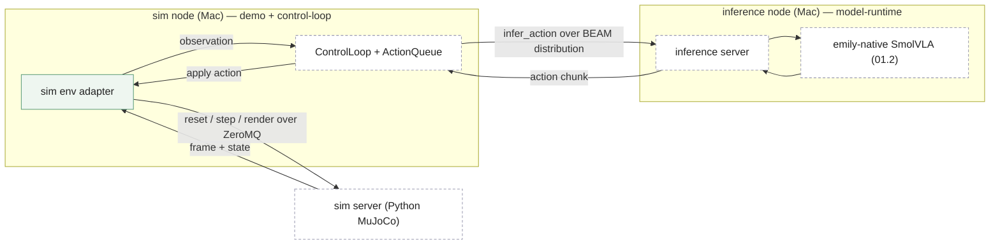

# demo context

This context owns the [demo rig](CONTEXT.md#term-demo-rig): the two-node BEAM
cluster that makes the system's headline scenario — a robot driven by this Mac's
inference — actually run as a closed loop. It is a **scaffold**, not production:
it assembles the already-designed [control-loop](../control-loop/design.md) and
[model-runtime](../model-runtime/design.md) contexts and adds only what a
runnable demo needs that they deliberately exclude — a simulated world to act in
and the cluster wiring. Both production contexts are siblings and suppliers;
this context conforms to them and neither knows it exists.

The world is a LeRobot/MuJoCo simulation of the SO-101 arm — the robot the
`lerobot/svla_so101_pickplace` checkpoint was trained on — so the loop closes:
each action SmolVLA returns moves the simulated arm, and the next frame reflects
it (see [ADR-0011](../../adr/0011-demo-is-a-simulated-closed-loop.md#adr-0011)).

## 00 Foundation

:::goal
**A runnable closed perception→action loop**

A simulated SO-101 arm attempts the pick-and-place task: the simulation renders
a frame, SmolVLA infers an action chunk from it, the arm executes each action,
and the next frame reflects the movement — the whole vision→action loop
observable end to end. This is the root's first goal (a robot driven by the Mac
as inference server) made concrete and runnable in simulation, not a new
capability.
:::

:::goal
**A scaffold, never a fork of the production loop**

The demo reuses the production [ControlLoop](../control-loop/design.md) and
[ActionQueue](../control-loop/CONTEXT.md#term-action-queue) and the production
[emily-native adapter](../model-runtime/design.md) unchanged. What lives here is
only the demo-specific surface — the [sim env adapter](CONTEXT.md#term-sim-env-adapter),
the [sim server](CONTEXT.md#term-sim-server), and the two-node cluster topology —
so that hardening the demo never drifts the real loop and vice versa.
:::

:::no-goal
**Not real robot control**

The simulation models the arm's dynamics in MuJoCo physics, but no real servo,
kinematics solver, or safety clamp is built, and no physical robot is driven.
The "not robot-side control logic" boundary
([control-loop](../control-loop/design.md)) stays where it is — simulated
dynamics are in scope; real-hardware actuation is not. See
[ADR-0011](../../adr/0011-demo-is-a-simulated-closed-loop.md#adr-0011).
:::

:::no-goal
**Not real hardware**

No Raspberry Pi, no camera, no NERVES firmware. The
[LeRobot/MuJoCo simulation](CONTEXT.md#term-sim-server) replaces hardware
entirely — the demo is fully reproducible on one Mac. A real-hardware
integration is a possible future, not part of this demo.
:::

:::no-goal
**Not reinforcement learning**

The demo drives the existing supervised inference loop only. The root's
"Not reinforcement learning, yet" no-goal is untouched — the simulation is the
world the policy acts in, not a reward signal; no online learning, no
acting-while-learning coupling is introduced by running this demo.
:::

:::invariant {enforcement=convention}
**The demo owns no model or queue logic**

No forward-pass, action-queue, or fine-tuning logic is reimplemented in this
context — every such call routes to the production context that owns it. A copy
of queue or inference logic appearing here is a design violation, not a
shortcut.
:::

:::principle {id=P1 lens=composition}
**The demo is assembly, the production contexts are the parts**

The demo rig is what "small, powerful abstractions that compose" looks like at
the top: the [sim node](CONTEXT.md#term-sim-node) composes the sim env adapter +
the production control loop; the [inference node](CONTEXT.md#term-inference-node)
exposes the production adapter over the cluster. The demo adds wiring, never new
mechanism.
:::

## Pending updates

:::pending {kind=build since=2026-07-17}
The [sim viewer](CONTEXT.md#term-sim-viewer) — an optional live 3D MuJoCo window
on the [sim server](CONTEXT.md#term-sim-server), off by default, showing the arm
move under real inference — is designed, not yet built. Presentation only: it
reads the running env, adds no model or queue logic, and leaves the sim wire
contract, `SimEnvAdapter`, and `ControlLoop` untouched. See
[ADR-0013](../../adr/0013-live-mujoco-viewer-mode-on-the-sim-server.md#adr-0013).
:::

## 01 System at a glance

**Two BEAM nodes, one cluster, one simulation.** The sim node runs the whole
tick loop against a simulated arm and calls across the cluster to the Mac's
inference node; the Mac answers one
[infer_action](../model-runtime/CONTEXT.md#term-infer-action-port) at a time and
knows nothing about the simulation.



:::info {title="Reading the two-node cluster"}
The solid green box is owned by this context; dashed white boxes are owned by
[control-loop](../control-loop/design.md) and
[model-runtime](../model-runtime/design.md), or are the external Python
[sim server](CONTEXT.md#term-sim-server), drawn here only as the units the demo
assembles and talks to. The `infer_action` edge is a native BEAM
`GenServer.call` — the port answered across the cluster with no foreign
serialization, per
[ADR-0010](../../adr/0010-beam-distribution-orthogonal-to-infer-action-port.md#adr-0010).
The sim edge is a ZeroMQ/MessagePack round trip to the external physics engine,
per [ADR-0012](../../adr/0012-sim-env-bridged-via-python-sim-server-over-zeromq.md#adr-0012).
:::

## 02 Components

:::cards {cols=2}

### sim env adapter `lens:composition+robustness`

**Own the simulation seam — obs out, action in, as one step cycle.** Drives one
LeRobot/MuJoCo gym env through the [sim server](CONTEXT.md#term-sim-server) and
exposes both interfaces the production
[ControlLoop](../control-loop/design.md) needs — the
[observation source](../control-loop/CONTEXT.md#term-observation-source) and the
actuator sink — because producing the next
[observation](../model-runtime/CONTEXT.md#term-observation) and consuming the
[action](../model-runtime/CONTEXT.md#term-action-chunk) are two halves of one
`env.step`. See 01.1.

### sim node (cluster wiring) `lens:composition`

**Own the two-node assembly and distribution.** Starts the supervision tree
(sim env adapter → control loop), connects to the
[sim server](CONTEXT.md#term-sim-server), and joins the
[inference node](CONTEXT.md#term-inference-node)'s cluster so the cross-node
`infer_action` call resolves. Pure assembly and wiring, no mechanism. See 01.2.
:::

### 01.1 sim env adapter — responsibility, interface, invariants

**Responsible for:** driving one LeRobot/MuJoCo gym environment (the SO-101
pick-and-place task) through the [sim server](CONTEXT.md#term-sim-server), and
exposing it to the production [ControlLoop](../control-loop/design.md) as both
its [observation source](../control-loop/CONTEXT.md#term-observation-source) and
its actuator sink. On an observation request it returns the current
[observation](../model-runtime/CONTEXT.md#term-observation) — the env's rendered
frame, the arm's proprioceptive state, and the fixed demo instruction; on an
action it calls `env.step`, advancing the simulation.

**Interface:**
```elixir
SimEnvAdapter.start_link(opts) :: {:ok, pid()}      # connects to the sim server, resets the env
SimEnvAdapter.observe(adapter) :: Observation.t()   # the ControlLoop observation_source function closes over this
SimEnvAdapter.actuate(adapter, action) :: :ok       # the ControlLoop actuator_sink; applies action via env.step
```

**Interacts with:** the Python [sim server](CONTEXT.md#term-sim-server) over a
`chumak` ZeroMQ REQ/REP socket with MessagePack framing (the same transport as
[model_runtime_server](../control-loop/design.md), per
[ADR-0012](../../adr/0012-sim-env-bridged-via-python-sim-server-over-zeromq.md#adr-0012)),
issuing `reset` / `step` / `render`; and the production
[ControlLoop](../control-loop/design.md), which calls `observe/1` when it needs
the current observation to fire an `infer_action` and `actuate/2` on each popped
action. It produces the value object
[model-runtime](../model-runtime/design.md) consumes but never itself
constructs.

**Invariants held:** the produced observation's state vector never exceeds the
loaded checkpoint's `max_state_dim` — the same fail-loud bound
[model-runtime](../model-runtime/design.md) component 01.1 and the ZeroMQ wire
format both enforce, honored here at the point of production so a malformed
observation never reaches the port. Obs-out and action-in stay one coupled unit:
a `step` both applies the action and yields the frame the next `observe` returns,
so the adapter never fabricates an observation divorced from the arm's real
state.

**Fails:** a sim-server error (dead process, lost socket, an env that raised)
surfaces loud and local — `observe/1` and `actuate/2` raise or return an
explicit error rather than fabricating a blank frame or silently dropping an
action, so a broken simulation stops the demo visibly instead of feeding SmolVLA
a stale or black image.

### 01.2 sim node (cluster wiring) — responsibility, interface, invariants

**Responsible for:** starting the demo's supervision tree — the
[sim env adapter](CONTEXT.md#term-sim-env-adapter) and the production
[ControlLoop](../control-loop/design.md) + `ActionQueue`, wired so the loop's
observation source and actuator sink are both the sim env adapter — and joining
the Mac's [inference node](CONTEXT.md#term-inference-node) into one BEAM cluster
so the cross-node `infer_action` call resolves to the inference server.

**Interface:** boot-time — starting the node establishes the sim-server
connection, the supervision tree, and distribution (node name, cookie, and
connecting to the inference node). No runtime API surface beyond the production
`ControlLoop`'s own.

**Interacts with:** the [inference node](CONTEXT.md#term-inference-node) across
BEAM distribution — the `ControlLoop` on this node calls the inference server on
the Mac by `GenServer.call({name, inference_node}, ...)`, the native BEAM
realization of the
[infer_action port](../model-runtime/CONTEXT.md#term-infer-action-port) across
the cluster (no MessagePack, no ZeroMQ — that path stays inference's own). See
[ADR-0010](../../adr/0010-beam-distribution-orthogonal-to-infer-action-port.md#adr-0010).

**Invariants held:** the demo owns no model or queue logic (this context's
foundation invariant) — the node is pure assembly and distribution wiring; every
inference and queue operation routes to the context that owns it.

**Fails:** a lost cluster connection to the inference node degrades exactly as
[control-loop](../control-loop/design.md) component 01.1 already specifies — the
distributed `GenServer.call` returns an error/timeout, the tick loop keeps
draining the queue it already has, and an empty queue is control-loop's surfaced
degraded condition, not a new demo-specific failure mode.

## 03 The seam to the production contexts

**The demo is a customer of both production contexts.** It reuses their units
unchanged and adds only assembly; the relationship is one-directional
(conformist), and neither production context references this one.

:::cards {cols=2}

### → control-loop

The sim node hosts the production
[ControlLoop](../control-loop/design.md) + `ActionQueue` unchanged. The demo
supplies the two external interfaces control-loop's design leaves open — its
actuator sink and its
[observation source](../control-loop/CONTEXT.md#term-observation-source) — both
provided by the single [sim env adapter](CONTEXT.md#term-sim-env-adapter).
Closing the loop only became possible once control-loop gained the
observation-source seam (its component 01.1), which the demo is the first
customer of.

### → model-runtime

The inference node hosts model-runtime's
[inference server](../model-runtime/design.md) (component 01.5) wrapping the
emily-native adapter (01.2). The demo calls it across the cluster as the
[infer_action port](../model-runtime/CONTEXT.md#term-infer-action-port); the
server is owned by model-runtime, and the cross-node transport is the topology
axis of
[ADR-0010](../../adr/0010-beam-distribution-orthogonal-to-infer-action-port.md#adr-0010),
not a demo-specific adapter.
:::

## 04 End-to-end walkthrough

**Scenario: one tick of the demo rig, the queue running low.**

1. On the [sim node](CONTEXT.md#term-sim-node), the production
   [ControlLoop](../control-loop/design.md) pops the next action from its
   [ActionQueue](../control-loop/CONTEXT.md#term-action-queue) and hands it to
   its actuator sink — the [sim env adapter](CONTEXT.md#term-sim-env-adapter) —
   which calls `env.step(action)` on the [sim server](CONTEXT.md#term-sim-server):
   the simulated arm moves. This is the tick's visible effect.
2. `ControlLoop` sees the queue has dropped below its
   [low-water threshold](../control-loop/CONTEXT.md#term-low-water-threshold) and
   asks its [observation source](../control-loop/CONTEXT.md#term-observation-source)
   — the same sim env adapter — for the current
   [observation](../model-runtime/CONTEXT.md#term-observation): the freshly
   rendered frame, the arm's state, and the fixed instruction.
3. `ControlLoop` fires an async `infer_action` by calling the
   [inference server](../model-runtime/design.md) on the Mac's
   [inference node](CONTEXT.md#term-inference-node) across BEAM distribution —
   the observation is passed as a native BEAM term, no foreign encoding.
4. The inference node runs the emily-native forward pass (component 01.2) and
   returns one [action chunk](../model-runtime/CONTEXT.md#term-action-chunk)
   across the cluster; `ControlLoop` enqueues it, exactly as its own design
   specifies.
5. Subsequent ticks keep popping actions to the sim env adapter, each advancing
   the arm; the loop continues, and the arm's motion in simulation is the demo's
   observable result. No step here is demo-specific except the sim-env steps
   (step 1) and observation (step 2) — everything between is the production loop
   unchanged.
