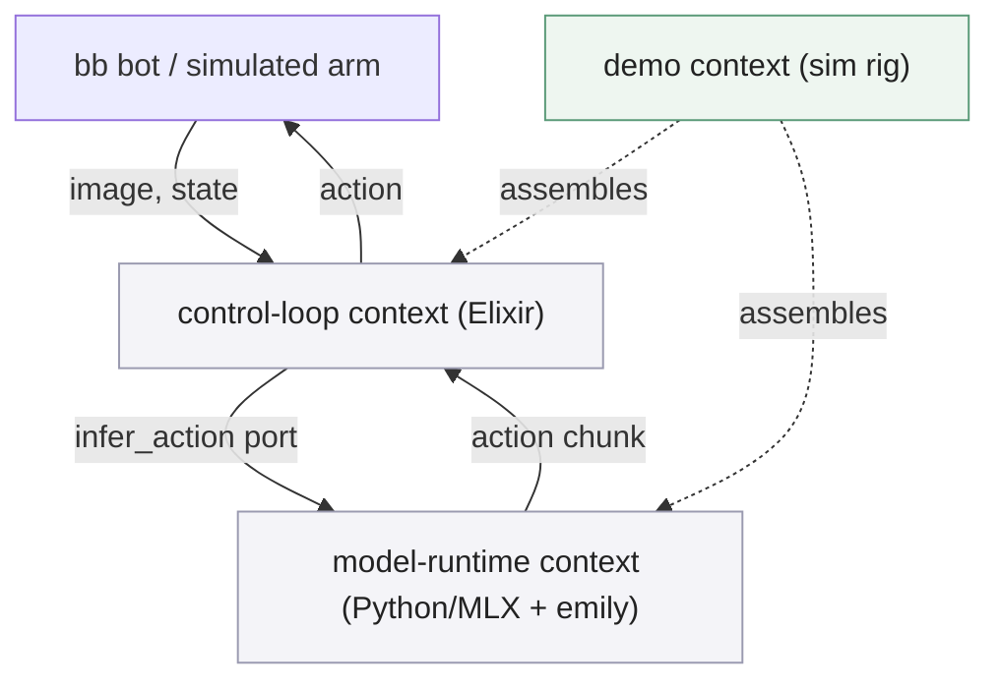

# smolVLA-mlx — root design

This system has two genuinely different vocabularies — a Python/ML-library
side and an Elixir/BEAM side — joined by exactly one seam: the
`infer_action` port. This root document carries only the foundation that
applies across both, the port seam itself, and the end-to-end walkthrough. Each
context indexes its own components below.

## 00 Foundation

:::goal
**SmolVLA runs locally, no cloud dependency**

Run SmolVLA inference and fine-tuning on this Mac via MLX (Apple Silicon,
Metal-accelerated), with no cloud or discrete-GPU dependency. The robot itself
runs elsewhere — a Raspberry Pi, joining the same Elixir/BEAM cluster as a
node ([control-loop](control-loop/design.md)) — with this Mac reached over
the network as the `infer_action` and fine-tuning server; same-host operation
stays legal but is never assumed.
:::

:::goal
**Upstreamable SmolVLA support in mlx-vlm**

Add SmolVLA to [Blaizzy/mlx-vlm](https://github.com/Blaizzy/mlx-vlm) in a shape
that project would plausibly merge: a `model_type`-keyed config and model
class, weight loading against `model.safetensors.index.json`, tests — see
[model-runtime](model-runtime/design.md).
:::

:::goal
**Fine-tune from real and simulated episodes, intended native**

Fine-tune SmolVLA's action expert on this Mac against
[episodes](model-runtime/CONTEXT.md#term-episode) sourced from either real
robot usage (the Pi, in production) or a simulation environment — the source
never changes the fine-tuning contract. Elixir-native training (`Nx`/`Axon`)
is the intended path, conditional on proven task-performance parity against
the Python reference trainer; Python fine-tuning is the permanent fallback
otherwise. See [model-runtime](model-runtime/design.md) and
[ADR-0005](../adr/0005-elixir-native-finetuning-conditional-retirement.md#adr-0005).
:::

:::goal
**A real 5Hz-class control loop, owned by Elixir**

Drive a physical bb bot's vision→action loop from an Elixir/BEAM cluster, with
Elixir owning the action queue and tick timing directly — not a policy
inherited from Python. See [control-loop](control-loop/design.md). See
[ADR-0002](../adr/0002-elixir-owns-the-control-loop.md#adr-0002).
:::

:::goal
**One port, two adapters, chosen by evidence**

Treat the Mac as a service reachable behind one `infer_action` port (see the
system at a glance below), with two candidate adapters —
an Elixir-native port via `emily`/`Nx.Defn` (the intended production path) and
a Python process reached over ZeroMQ (a permanent, first-class fallback, not a
throwaway shim). See [ADR-0003](../adr/0003-emily-native-primary-zeromq-fallback.md#adr-0003).
:::

:::no-goal
**Not training from scratch**

Fine-tuning a pretrained SmolVLA checkpoint only; training a policy from
scratch is out of scope.
:::

:::no-goal
**Not distributed training**

Fine-tuning runs on this one Mac; multi-node/distributed training is out of
scope.
:::

:::no-goal
**Not reinforcement learning, yet**

Real and simulated data both feed [supervised
fine-tuning](model-runtime/design.md) only — no reward-signal entity, no
online/on-policy training loop, no acting-while-learning coupling to
[control-loop](control-loop/design.md) is designed here. Revisit when a
concrete RL approach is chosen; until then this stays an explicit exclusion,
not a silent gap.
:::

:::no-goal
**Not robot-side control logic**

Kinematics, safety clamping, and action interpolation between ticks live
elsewhere and are not designed here. This system's Elixir side is the
`infer_action` caller and queue owner, nothing more.
:::

:::no-goal
**Not hard real-time**

Soft-realtime at a target tick rate, not certified determinism or hard
latency bounds.
:::

:::no-goal
**Not committing to the full-scale port sight unseen**

A `/prototype` run (2026-07-12) de-risked the core mechanism — see
[model-runtime](model-runtime/design.md), component 01.2 — confirming the
emily-native adapter as the production path. Still not committed: the
full-scale port against SmolVLA's real weights and full backbone size, which
remains a pending build entry in that same document.
:::

:::invariant {enforcement=convention}
**Weights are the only cross-runtime artifact**

Nothing but trained weights (safetensors) crosses the Python/Elixir boundary.
The two forward-pass implementations share no code, by construction of MLX
having no portable graph-export format. See
[ADR-0004](../adr/0004-weights-only-cross-runtime-sharing.md#adr-0004).
:::

:::invariant {enforcement=convention}
**The port is one contract, not two features**

Both adapters implement the exact same `infer_action(observation) ->
action_chunk` contract
([model-runtime](model-runtime/CONTEXT.md#term-infer-action-port)); a caller
switches adapters without changing anything upstream of the port.
:::

:::principle {id=P1 lens=modeling}
**Ports and adapters over special-casing the transport**

One `infer_action` port, two adapters behind it, chosen by evidence
(a prototype) rather than committed by assumption. Neither adapter leaks its
shape across the port.
:::

:::principle {id=P2 lens=composition}
**The Python fork stays upstreamable**

No Elixir-specific or bb-bot-specific concern leaks into the mlx-vlm fork;
it is designed to be a mergeable PR on its own terms.
:::

## Pending updates

:::pending {kind=build since=2026-07-16}
The [demo](demo/design.md) context — a simulated SO-101 arm driven as a closed
loop by the production control loop on a sim node, clustered to a Mac
[InferenceServer](model-runtime/design.md) over BEAM distribution — is designed
but not built. It depends on `ControlLoop`/`ActionQueue` (built) gaining an
observation-source seam and on the `InferenceServer` being built. See
[ADR-0011](../adr/0011-demo-is-a-simulated-closed-loop.md#adr-0011) and
[ADR-0012](../adr/0012-sim-env-bridged-via-python-sim-server-over-zeromq.md#adr-0012).
:::

## 01 System at a glance

:::info {title="Reading the port seam"}
`control-loop` is the only customer of the `infer_action` port;
`model-runtime` is the only supplier, through either of its two adapters. The
bb bot never talks to `model-runtime` directly — everything robot-facing stays
inside `control-loop`. The `demo` context is a scaffold (dashed edges): it
assembles the two production contexts into a runnable two-node rig around a
simulated arm, and owns no model or queue logic of its own — see
[demo](demo/design.md).
:::

## 02 The three contexts

:::cards {cols=3}

### model-runtime `lens:depth`

**Own SmolVLA's forward pass, its weights, and how they're produced or
consumed.** The mlx-vlm fork (config, model class, `infer_action()`,
fine-tuning), the Elixir-native `Nx.Defn` port, and the `InferenceServer` that
exposes it across a cluster live here behind one port. Its vocabulary: action
chunk, action expert, infer_action port, episode. Read
[model-runtime](model-runtime/design.md).

### control-loop `lens:state`

**Own the bb bot's tick loop and everything Elixir.** The `ControlLoop`
GenServer, the `ActionQueue` it owns, and the ZeroMQ client that reaches the
Python fallback adapter over the network. Its vocabulary: control loop, action
queue, low-water threshold. Read [control-loop](control-loop/design.md).

### demo `lens:composition`

**Own the runnable sim rig that assembles the other two.** A sim node (a
LeRobot/MuJoCo simulated SO-101 arm and the production control loop) clustered
to a Mac inference node over BEAM distribution — a scaffold owning no model or
queue logic, closing the perception→action loop in simulation. Its vocabulary:
demo rig, sim node, sim env adapter, sim server. Read [demo](demo/design.md).
:::

## 03 End-to-end walkthrough

**Scenario: one tick of the bb bot's control loop, consuming a queued
action and topping up the queue.**

1. The bb bot captures a camera frame and its own joint state; `control-loop`'s
   `ControlLoop` GenServer holds these as the next tick's
   [observation](model-runtime/CONTEXT.md#term-observation).
2. `ControlLoop` pops the next action off its
   [ActionQueue](control-loop/CONTEXT.md#term-action-queue) and sends it to the
   bb bot's actuators — the actual tick.
3. `ControlLoop` checks the queue's depth against its low-water threshold. If
   the queue is running low, it calls the
   [infer_action port](model-runtime/CONTEXT.md#term-infer-action-port) with
   the current observation, through whichever adapter is active
   (emily-native in-process, or the ZeroMQ client to the Python fallback).
4. `model-runtime`'s adapter runs SmolVLA's forward pass — vision + state +
   instruction in, one
   [action chunk](model-runtime/CONTEXT.md#term-action-chunk) out — and
   returns it across the port.
5. `ControlLoop` aggregates the new chunk into its `ActionQueue`, merging with
   whatever is still executing, and the loop continues to the next tick.

No step in this path assumes which adapter is active — that is the port's
entire job.
